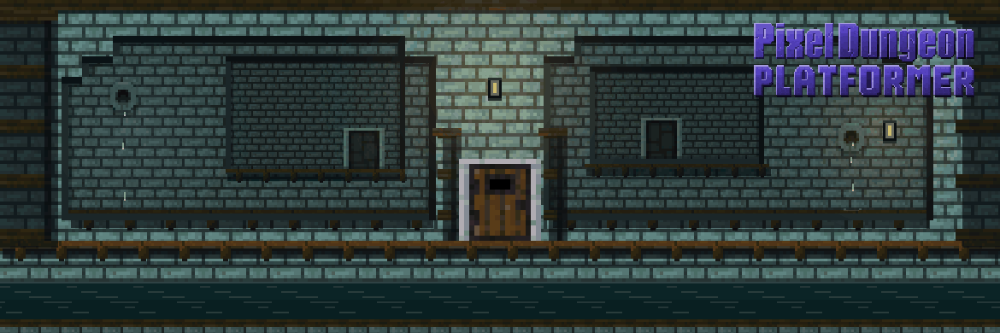

# Skillful Pixel Dungeon Platformer

Skillful Pixel Dungeon Platformer is a LibGDX action-platformer built around Pixel Dungeon-inspired enemies, items, achievements, and progression systems.

This public repository contains the game code, assets, and build configuration needed to run the desktop build and assemble the Android app. Local development builds do not require store credentials.

**Platform support:** Desktop and Android. The HUD is optimized for desktop.

## Get the game

Buying the game on Steam supports the developer and includes these supporter bonuses:

- Steam achievements
- Steam Cloud saves
- A supporter badge
- The option to have Rat King accompany you on your adventure as an entertaining companion, with no gameplay advantage

[](https://store.steampowered.com/app/4725620/Pixel_Dungeon_Platformer/?utm_source=github&utm_medium=repository&utm_campaign=steam_conversion)
[](https://bilbolstack.com)



## Project layout

- `core`: shared gameplay code, content logic, and screens
- `desktop`: desktop launcher and optional Steam integration hooks
- `android`: Android launcher and app packaging
- `assets`: runtime textures, audio, fonts, and localization bundles

## Building

Requirements:

- JDK 17 or 21 available through `JAVA_HOME` or on `PATH`; the builds were verified with JDK 21
- Android SDK Platform 35 and SDK Build-Tools for Android builds, with SDK licenses accepted
- Set `ANDROID_HOME` to your SDK installation, or set `sdk.dir` in the ignored `local.properties` file

Use the included Gradle 8.7 wrapper from the repository root.

Common commands:

```bash
./gradlew :desktop:assemble
./gradlew :android:assembleDebug
./gradlew :android:assembleRelease
```

On Windows, use `gradlew.bat` instead of `./gradlew`.

These assembly tasks do not run tests. Desktop ZIP/TAR distributions are written to `desktop/build/distributions/`, and Android APKs are written to `android/build/outputs/apk/`. The release APK is minified and unsigned; debug builds use the locally generated Android debug signing key.

For local desktop development, run `./gradlew :desktop:run`. This launches directly from compiled classes without requiring Steam configuration. Set `SKILLFUL_DESKTOP_DEBUG_JAVA_HOME` if the desktop launcher needs a different JDK from Gradle.

Optional native desktop packaging is available through `./gradlew :desktop:packageSteamFree`. It requires a full JDK containing `jpackage`, configured through `JAVA_HOME` or `SKILLFUL_DESKTOP_DEBUG_JAVA_HOME`; `JPACKAGE` can override the packaging executable. Packages are created for the current host: Windows x64, Linux x64, or macOS arm64.

## AI and tooling disclosure

No art assets were created with generative AI, and the game does not include runtime generative AI features. GitHub Copilot was used as an assistive development tool during development.

## License

This project is distributed under the GNU GPL v3. See `LICENSE.txt` for the full license text.
